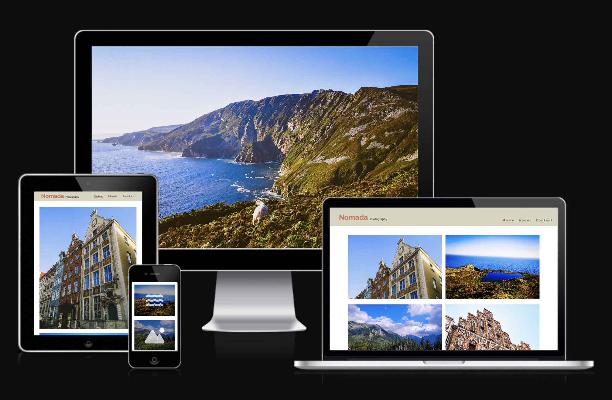
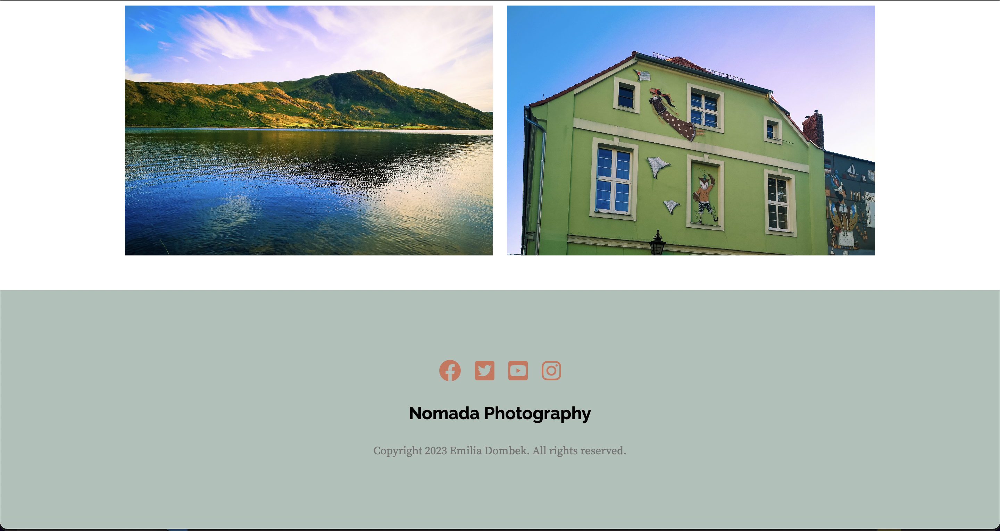
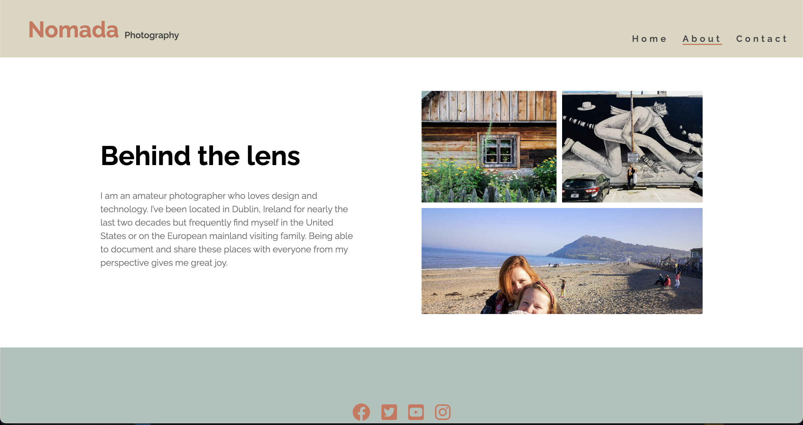
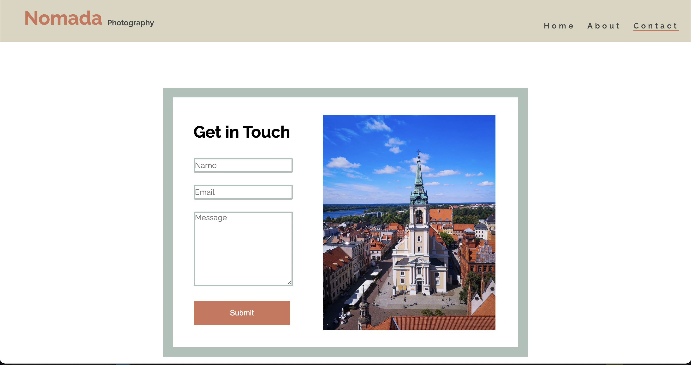

# Nomada Photography Readme

## Purpose and goals of the website

To showcase the travel photography work of Nomada photography. This could include photographs from different parts of the world, each highlighting the culture, landscape, and people of that area.

## User stories

- As a potential client, I want to view a portfolio of Nomada photography's work to see if their style aligns with my needs for an upcoming travel project.
- As a photography enthusiast, I want to explore different galleries on the website to see how Nomada photography captures unique travel experiences and to learn more about their techniques and approach to travel photography.
- As a frequent traveler, I want to browse the website to find inspiration for my own travel photography, and to discover new and interesting places to visit based on the images presented.

## Content and Structure

- HTML and CSS Flexbox as well as CSS variable roots
- Github Repo: <https://github.com/emidombek/nomada-photo>
- Page structure:

  - Gallery Landing Page, Destination Pages (8) About and Contact in total there are 11 pages:

  1. Gallery Landing Page:

     - The first thing the user sees on a is a large fullscreen hero image that on hover allows the use to click on link that takes them down further to the Logo Banner and Navigation Menu. This is meant to engage and immerse the user in the image and the place the photograph was taken in (this same large hero image and hero link is employed for every webpage on the site):
       
     - After the user clicks the link the page jumps down to the Logo Banner where the logo of the Photographer is seen as well as a Navigation Menu (the page layout has been modified for mobile devices and other devices that respond to touch). The gallery of the main body is also partially visible this is meant to entice the user to scroll through. There are eight photos in total of different destinations in this gallery that lead to 8 destination pages when the photo is clicked on or tapped, on devices that can hover an icon will appear that can be clicked on non-hover devices the icon will be displayed immediately:
       
     - At the bottom of every page is a footer with social media links and a 'Nomada Photography' link that takes the user back to the top of the Logo Banner where the Navigation Menu is. Underneath this is the copyright text:
       

  2. Destination Pages

     - The Destination Pages allow the user to view an additional 4 images from the selected destination. There is a hover/tap to reveal that allows users to view information on where and when the photo was taken:
       
     - The Destination Pages differ only in text descriptions and images. The HTML/CSS is the same on each page besides the different image files and text.

  3. About Page

     - The About Page contains a small gallery of selected images and a small about section:
       

  4. Contact Page
     - The Contact Page includes a dummy webform:
       

## Design and Layout

The design for the website was created in Adobe XD with the quick mockup plugin. The design has evolved somewhat as I have been implementing and testing it.

- Overall styling: Removing default margins/padding/borders, adding basic backround color,text styles and display properties to the Body through selecting Body/Header/Main/Footer.
- Custom styling on some elements, several hover effects have been used in the Header, Main and Footer section of the Body many of these have been removed or modified for smaller screens via media queries.
- The Landing Page and Destination pages only differ in gallery containers and hover effects used with those gallery containers.

- Primary Design System is as follows:

  --font-family: Raleway, sans-serif, Source Serif Pro, sans-serif;
  --primary-font: Raleway, sans-serif;
  --secondary-font: Source Serif Pro, sans-serif;
  --main-color: white;
  --background-color: white;
  --primary-color: #D8D5BF;
  --secondary-color: #AEC1BA;
  --accent-color: #CF755A;
  --text-color-primary: #000000;
  --text-color-secondary: #464646;
  --text-color-accent: #CF755A;
  --text-color-secondary-accent: #737373;
  --line-height: 1.5;

High Fidelity Wireframes and a Prototype that have been created in Adobe XD can be found here:

- Design Review Prototype in Adobe XD: <https://xd.adobe.com/view/4d002e9a-15fe-4078-863d-420e3ac33da3-1853/>

- Wireframes imported into Figma: <https://www.figma.com/file/Vz4TudFv2r2o7fMv8JYdDF/Nomada-Photography?type=design&node-id=0%3A1&t=55xebaSEyXd1LKoy-1>

Main Landing Page Wireframe:

## Code

All pages:

- HTML boilerplate for all pages to start then used custom HTML, styled using CSS flexbox. All pages have the same Head, Header and Footer.

Gallery Landing and Destination Pages description of Code and Content:

(Landing page: index.html) (Destination pages: chelmno.html, connemara.html, tatra.html, torun.html, richmond.html, bydgoszcz.html, slieveleague.html, gdansk.html)

- Head

  1. Contains Metadata for website.
  2. Contains website title.

- Body

  - Header

  1. Hero Image
     - Unusally large hero image which allows the user to experience the photo in fullscreen with hover elements then give context and allow the user to jump further down to the menu section. This has been modified for smaller screens to ensure good UX.
     - The .hero-image class centers and sizes the image container, while the .hero-image img class sets the properties of the image itself.
     - The .image-overlay class creates a darkened overlay effect that can be used with both hero images.
     - The .text-overlay class styles text contained within the image overlay, and the .middle class adds a link that allows users to jump to the menu section of the page.
     - The .text-box-hover class creates a box-like appearance when the user hovers over it.
  2. Logo Banner
     - Large banner below the Hero Image which contains the navigation menu and logo text.
     - The logo banner section has a background color, padding, and is arranged as a flex container with the logo and another element aligned to the left and right sides respectively.
     - The logo itself is styled with a bold font and a specific size, color, and padding. There is also another element styled with a different font size, color, and alignment.
     - The menu section is also a flex container and has its font size and letter spacing set. Each menu item is styled without bullets and with some margin between them.
     - The menu items are links with their own styling, including a hover effect and the option to set one as active.
     - The #logo element has been left as an id instead of class so it can be reference in links in the .hero-image-container section as well and the Footer .footer-text-container.
     - The menu section is also a flex container and has its font size and letter spacing set. Each menu item is styled without bullets and with some margin between them. The menu items are links with their own styling, including a hover effect and the option to set one as active.

  - Main

  1. Gallery
     - The gallery container uses grid display to organize its images in columns and rows, with specific column width, row height, column gap, and row gap. This container is used to display the 8 images with corresponding links that lead the user to the destination pages.
     - The gallery-container2 has a different row height setting that repeats twice and ensures an equal amount of space in the container is occupied by the rows. This container is used to display the 4 images on the destination pages.
     - The h4 element is set to display none, which means it won't be visible in the gallery.
     - The images in the gallery columns are set to object-fit: cover, which means they will scale and crop to fill the available space while maintaining their aspect ratio, and object-position: top is used to align the images at the top of the container.
     - The image-overlay and image-overlay2 classes are used to create an overlay on the images, with a semi-transparent black background and centered text.
     - The gallery-column i and gallery-column-center i classes define an icon for the gallery columns, which is set to the main color.
     - Finally, the text-overlay2 class is used to create a text overlay on top of the images, positioned at the center of the container.

  - Footer

    1. Footer Banner
       - The Footer Banner is a larger banner that contains social media icons that link to different social media sites. There is also a heading that links to the #logo at the top of the page which takes the user back to the menu when selected.
       - The footer container (footer-text-container) is positioned absolutely and arranged as a vertical column. It has a background color and text color specified.
       - The main footer text (footer-text) has a background color, bold font, and centered alignment. It transitions smoothly when its color changes via hover effect.
       - The copyright text (copyright-text) has a specific color, font, and alignment.
       - Social network icons (social-networks) are displayed as a horizontal list in the center. Each icon has some margin around it.
       - The social network icon elements (social-networks i) have a larger font size, centered alignment, and a specific color. They also transition smoothly when their color changes via hover effect.

About Page description of Code and Content:

- Head: Same content as the Gallery Landing and Destination Pages.

  - Body: Header and Footer are the same as the Gallery Landing and Destination Pages.
    - Main: The section is divided into two parts: a text area and an image area.
      1. About Body Container
         - The entire section is contained within a section container element with class name "about-body-container", with a maximum width of 1200 pixels, centered horizontally on the page with margins set to 0, and aligned vertically with the center of the page using flexbox properties.
      2. About Textbox
         - The text area is divided into a h3 heading with class name "about-heading" and a div body of text with class name "about-textbox". The heading is styled with a large, bold font and a primary text color. The body of text is styled with a smaller font and a secondary text color.
      3. About Image Grid
         - The image area is divided into two rows: a row of smaller images with class name "about-small-images" and a single larger image with class name "bottom-image" beneath them.
         - The smaller images are arranged in a row with a gap of 10 pixels between them and are each no wider than a certain width, with each image contained within an img tag with class name "about-small-images img". The larger image is twice the width of the smaller images and has a maximum height of 200 pixels, contained within an img tag with class name bottom-image img.

  Contact Page description of Code and Content:

  - Head: Same content as the Gallery Landing and Destination Pages.

    - Body: Header and Footer are the same as the Gallery Landing and Destination Pages.

      - Main

        1. Contact Form Container - The form is contained within a forum element with the class "contact-form-container", which is styled to be centered, have a width of 50%, and a border of 20px with a color defined by the variable "--secondary-color". The form itself is within a div with the class "contact-form", which has a background color defined by the variable "--background-color", a maximum width of 40%, and padding of 2em. The form title, defined by an h5 element with the class "contact-title", is styled to have a font family of "--primary-font", be bold and have a font size of 34px.

        2. Contact Form Image - An image is also included in the form, within a div with the class "contact-form-image". The image is centered and has a maximum width of 50%.

        3. Contact Forum - This form is a dummy forum setup with GET and an action that will redirect the user back to contact.html essentially reloading the page. The Name, Email and Message text input fields are all required to be completed before the form can be submitted. - Text inputs within the form, defined by elements with the class "text-input-contact", have a font family of "--primary-font", regular font weight, font size of 16px, and a color defined by the variable "--text-color-secondary". The input fields have a width of 100%, height of 25px, and a margin of 5px 0 20px 0. They also have a border of 3px with a color defined by the variable "--text-color-secondary" and a border radius of 3px. - The message input field, defined by an element with the class "message", has the same styling as the text input fields, but with a height of 150px. - When the input fields are in focus, they have an outline removed and a border color of "--accent-color". - The submit button has the class "submit-button" and has a width of 100%, box-sizing of border-box, margin-top of 2%, border radius of 2px, and padding of 1em. Its font size is set to 100%, and it has a background color defined by the variable "--accent-color" and text color defined by the variable "--main-color". The button is displayed as a block element. The submit button also has a hover effect that changes it's color.

    Media Queries:

    - Logo Banner and Menu Media queries:

      1. For screens with a maximum width of 768 pixels, the logo banner and menu elements are adjusted. The logo banner is displayed as a flex container with wrapped items and given some padding. The logo itself has no padding, and an additional logo element has a small bottom margin. The menu is displayed as a flex container with centered content and left padding. Each menu item has some margin, and the menu links are set to occupy equal space.

  - Gallery Containers for the Main Gallery Landing Page:

    1. For screens up to a maximum width of 1200 pixels: The .gallery-container element is styled to have a grid layout with 2 columns and 8 rows.

    2. Up to a maximum width of 885 pixels:Both the .gallery-container and .gallery-container2 elements have a grid layout with 1 column and 1 row. A 30-pixel gap is added between the rows. Padding of 5% is applied to the elements. The .gallery-column and .gallery-column-center elements use flexbox to occupy equal space.

    3. Up to a maximum width of 480 pixels: The .text-overlay2 element has a font size of 16 pixels. The element is vertically centered at 50% from the top.

  - Contact Form:

    1. For screens up to a maximum width of 768 pixels: The .contact-form-container element is styled to have a width of 80% of its parent container. The .contact-form element has a maximum width of 60%. The .contact-form-image element is set to not be displayed (hidden).

  - About Page:

    1. .about-body-container sets the container to have a column flex-direction and center-aligns its contents.

    2. .about-textbox and .about-image-grid have their width set to auto and a margin of 5%.

    3. .about-heading sets the font size to 36 pixels.

    4. .about-small-images allows flex items to wrap, with centered justification.

    5. .about-small-images img sets the maximum width of small images to 40%.

    6. .bottom-image is a flex container that centers its contents and has a margin of 1% on the top and bottom, auto margin horizontally, a width of 83%, and a height set to auto.

    7. bottom-image img sets the maximum width and height of the image to 100%.

- Hero Image Settings for smaller screens

  1. For screens smaller than 767 pixels:
     - The height of the hero image adjusts automatically.
     - The maximum height of the hero image is set to 400 pixels.
     - An overlay on the hero image has an opacity of 0.3.
     - Two separate overlays have an opacity of 0.3.
     - The text overlay is positioned at 30% from the top and has a font size of 24 pixels.
     - The text box hover effect is hidden.
  2. For screens smaller than 480 pixels:
     - The overlay effect is applied to index gallery images by setting the opacity of .image-overlay to 0.7.
     - The overlay effect is excluded from hero images within .hero-container .hero-image by hiding the .image-overlay element.
     - Text overlays (.text-overlay and .text-overlay2) are positioned at 50% from the top, have a font size of 16px, and are initially transparent.
     - When hovering or focusing on images within .gallery-column2, the overlay (image-overlay2) becomes visible with an opacity of 0.7, and the corresponding text overlay (text-overlay2) becomes fully opaque.

- Query that exlcudes devices that cannot hover '@media (hover: hover)' from certain hover effects.

  1. The following hover effects are included in this exclusion The opacity of .hero-image .image-overlay and .hero-image .middle is set to 0 with a transition effect. When .hero-image is hovered over, the opacity of these elements becomes 0.9.

  2. Elements with classes .gallery-column, .gallery-column-center, and .gallery-column2 have a transition effect on opacity. When these elements are hovered over, the opacity of .image-overlay and .image-overlay2 becomes 0.7

  3. When icons within .social-networks are hovered over, their color is changed to var(--main-color).

  4. When text within .footer-text is hovered over, its color is changed to var(--main-color).When .submit-button is hovered over, its background color becomes var(--primary-color) and its text color becomes var(--main-color).

## Deployment

The site was deployed to GitHub pages. The steps to deploy are as follows:

1. In the GitHub repository, on the Code page navigate to the Environments section on the righthand side of the page.
2. Click on github pages, this will take you to deployments history where you willl be able to click on 'view deployment'.
   The live link can be found here - [Link to Site Here](https://github.com/emidombek/nomada-photo)

## Testing

All pages pass the W3C HTML Validator and the W3C CSS Validator/Jigsaw.

The site was tested on the following devices:

- Android:

  - Samsung Galaxy S20
  - Xiaomi Mi 11i
  - Huawei P20 PRO
  - Huawei P30 PRO
  - Google Pixel5
  - Oneplus Nord 2
  - Galaxy Z Flip3
  - OPPO Find X3 PRO
  - Galaxy A12
  - Google Pixel 6 PRO
  - Xiaomi 12

- iPhones:

  - iPhone 5
  - iPhone SE 2016
  - iPhone X
  - iPhone XR
  - iPhone 11
  - iPhone 11 PRO
  - iPhone 11 PRO MAX
  - iPhone 12 Mini
  - iPhone 12
  - iPhone 12 MAX
  - iPad Mini
  - iPad Air 4
  - iPad PRO 11
  - Galaxy Tab S7
  - Microsoft Surface Duo

- Laptops/PC screens:
  - MacBook Air
  - MacBook Pro
  - Dell 24in Monitor

## Known Issues and Bugs

- The hover underline element in the main Navigation Menu is not centered on some smaller screens.
- The additional hover dropdown menu was removed as it had too many issues with responsiveness and was not essential to the UX of the site.

## Resources

- Content:
  - All photos used on this website were taken by me, Emilia Dombek.
  - Wireframes were made using the Quickmockup Plugin in Adobe XD.

- Code and Implementation:
  - VS code, Git, GitHub and Gitpages were used to code and deploy the website. I used the Code Academy Template to create my repo on GitHub.

- Learning Resources:
  - W3 schools for CSS
  - CSS flexbox knowlegde and concepts were mostly learned from: Kevin Powell's Youtube Channel <https://www.youtube.com/@KevinPowell>
  - Stack Overflow posts to help with understanding bugs and media queries.
