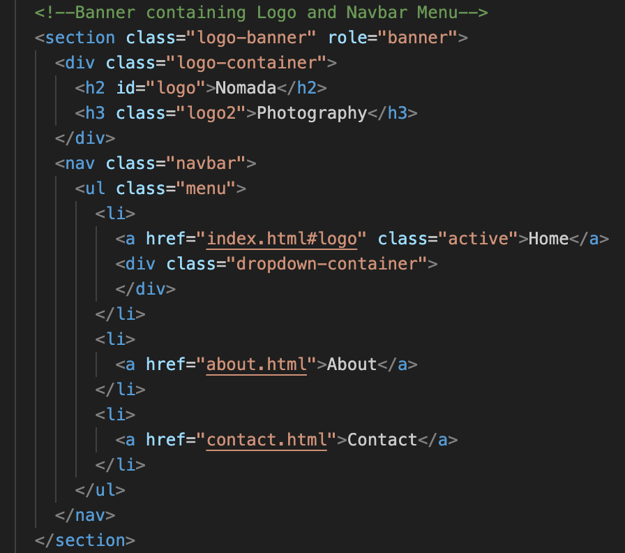

# Nomada Photography Readme

[Link to Live Site Here](https://emidombek.github.io/nomada-photo/)
## Table of Contents ## 
- [Nomada Photography Readme](#nomada-photography-readme)
  - [Table of Contents](#table-of-contents)
  - [Purpose and goals of the website](#purpose-and-goals-of-the-website)
  - [User stories](#user-stories)
  - [Content and Structure](#content-and-structure)
  - [Design and Layout](#design-and-layout)
  - [Technology](#technology)
  - [Code](#code)
  - [Deployment](#deployment)
  - [Testing](#testing)
  - [Known Issues and Bugs](#known-issues-and-bugs)
  - [Resources](#resources)
  - [Acknowledgments](#acknowledgments)
  - [Future Improvements](#future-improvements)

## Purpose and goals of the website

The purpose of the website is to exhibit the captivating travel photography portfolio of Nomada Photography. It aims to showcase a diverse range of photographs capturing landscapes and people from various locations around the world. The website's primary goal is to engage users by immersing them in the stunning visuals and offering an overview of the photographer's body of work. Additionally, the website provides a convenient way for visitors to contact Nomada Photography through a web form, ensuring easy communication. Social media links are also provided for users to connect with the photographer on various platforms.

## User stories

- As a potential client, I want to view a portfolio of Nomada Photography's work to see if their style aligns with my needs for an upcoming travel project.
- As a photography enthusiast, I want to explore different galleries on the website to see how Nomada Photography captures unique travel experiences and to learn more about their techniques and approach to travel photography.
- As a frequent traveler, I want to browse the website to find inspiration for my travel photography and discover new and interesting places to visit based on the images presented.
As a potential client, I want to contact the photographer via the website's contact form to inquire about availability and pricing and discuss specific requirements for my upcoming travel project.
- As an average user, I want to have a user-friendly and visually appealing browsing experience on the website. I expect intuitive navigation and clear organization of the galleries, allowing me to easily explore Nomada Photography's work and navigate between different travel destinations.

## Content and Structure

- HTML and CSS Flexbox as well as CSS variable roots
- Github Repo: <https://github.com/emidombek/nomada-photo>
- Page structure:

  - Gallery Landing Page, Destination Pages (8) About, Contact and Thank You. In total, there are 12 pages:

  1. Gallery Landing Page:

  - The first thing the user sees is a large fullscreen hero image that on hover allows the user to click on the link that takes them down further to the Logo Banner and Navigation Menu. This is meant to engage and immerse the user in the image and the place the photograph was taken.

  - After the user clicks the link the page jumps down to the Logo Banner where the logo of the Photographer is seen as well as a Navigation Menu (the page layout has been modified for mobile devices and other devices that respond to touch). The gallery of the main body is also partially visible this is meant to entice the user to scroll through. In this gallery, eight distinct photos are showcasing various destinations. Each photo serves as a clickable or tappable link that redirects you to a dedicated destination page. For devices with hover capability, an icon will appear upon hovering over the photo, which can then be clicked. On devices without hover capability, the icon will be displayed immediately, allowing users to click it directly.

  - At the bottom of every page is a footer with social media links and a 'Nomada Photography' link that takes the user back to the top of the Logo Banner where the Navigation Menu is. Underneath this is the copyright text.

     

       
Click here to view a screenshot of the Main Gallery Landing Page

  
       
  
       

     

       
Click here to view a demo of the Main Gallery Landing Page

  
       
  
       

  
  1. Destination Pages

  - The Destination Pages allow the user to view an additional 4 images from the selected destination. There is a hover/tap to reveal that allows users to view information on where and when the photo was taken:

     

       
Click here to view a screenshot of the Destination Gallery Page

       

       

     

       
Click here to view a demo gif of the Destination Gallery Page

       

       

  - The Destination Pages differ only in text descriptions and images. The HTML/CSS is the same on each page besides the different image files and text.

  3. About Page

  - The About Page contains a small gallery of selected images and a small About section:

     

       
Click to view a full screenshot of About Page

  
       

       

    

       
Click here to view a demo gif of About Page

       

       

  4. Contact Page
      
  - The Contact Page includes a dummy web form:

     

       
Click to view a full screenshot of the Contact Page

       

       

       
  5. Thank You Page

  - The user is redirected to this page when submitting a message via the Contact Form.

     

       
Click to view a demo gif of the Contact Page & Thank You Page

  
       

       

     

       
Click to view a full screenshot of the Thank You Page

  
       

       

## Design and Layout

The design for the website was created in Adobe XD with the quick mockup plugin, and wireframes were imported into Figma for ease of viewing and sharing. The design has evolved somewhat as I have been implementing and testing it for responsiveness. The initial concept was to develop a lightbox-style gallery containing only eight photos. However, during the website implementation process, this concept changed as I was coding it hands-on. It evolved into a per-page mini gallery for each destination, incorporating an extra set of four photos. This modification enabled the sharing of a broader range of work and provided users with a captivating travel-like experience when exploring the destinations.

- Overall styling: Removing default margins/padding/borders, adding basic background color, text styles and display properties to the Body by selecting Body/Header/Main/Footer.
- Custom styling on some elements and several hover effects have been used in the Header, Main and Footer sections of the Body many of these have been removed or modified for smaller screens via media queries.
- The Landing Page and Destination pages only differ in gallery containers and hover effects used with those gallery containers.
No back buttons are included in the design intentionally the user can return to the top of the page by clicking on the 'Nomada Photography' heading at the bottom of the page and then using the navigation menu.
- Image files were also not further compressed intentionally as this is a Photography Portfolio and maintaining the integrity of the colors and quality of the image takes priority over slightly longer loading times.
- For devices that are not able to hover, I have either fixed the image overlays to show or created a click-to-show effect.
  
The primary Design System is as follows:

  1. --font-family: Raleway, sans-serif, Source Serif Pro, sans-serif;
  2. --primary-font: Raleway, sans-serif;
  3. --secondary-font: Source Serif Pro, sans-serif;
  4. --main-color: white;
  5. --background-color: white;
  6. --primary-color: #D8D5BF;
  7. --secondary-color: #AEC1BA;
  8. --accent-color: #CF755A;
  9. --text-color-primary: #000000;
  10. --text-color-secondary: #464646;
  11. --text-color-accent: #CF755A;
  12. --text-color-secondary-accent: #737373;
  13. --line-height: 1.5;
 
 *Design System Colors*

 

 *Design System Fonts*

 
 
 
 

 *High Fidelity Wireframes and a Prototype that has been created in Adobe XD can be found here:*

 - [Design Review Prototype in Adobe XD](https://xd.adobe.com/view/4d002e9a-15fe-4078-863d-420e3ac33da3-1853/)

 - [Wireframes imported into Figma from Adobe XD](<https://www.figma.com/file/Vz4TudFv2r2o7fMv8JYdDF/Nomada-Photography?type=design&node-id=0%3A1&t=55xebaSEyXd1LKoy-1>)

 *Main Landing Page wireframe:*

   

   
Click to view the Main Gallery Landing Page Wireframe

  
      
   
   

 *Screenshot of all the wireframes in Figma:*

   

   
Click to view a screenshot of Figma Wireframes

  
      
   
   

## Technology

The technology used in this project is as follows:

  - [CSS](https://en.wikipedia.org/wiki/CSS) - style sheet language used to style the webpages
  - [HTML](https://en.wikipedia.org/wiki/HTML) - standard markup language 
  - [Code Institute Repo Template](https://github.com/Code-Institute-Org/ci-full-template) - GitHub repository template used to create the repository.
  - [Visual Studio Code](https://code.visualstudio.com/) - source code editor used to create, edit and publish the webpages with the assistance of Git/GitHub/GitPages.
  - [Adobe XD](https://www.adobe.com/products/xd/learn/get-started/what-is-adobe-xd-used-for.html) - vector-based experience design platform used to create the wireframes for this website
  - [Figma](https://www.figma.com/) - cloud-based design tool I used to share the wireframes.
  - [Git](https://en.wikipedia.org/wiki/Git) - distributed version control system
  - [GitHub](https://github.com/) - Git repository hosting service with a web-based graphical interface
  - [Gitpages](https://docs.github.com/en/pages/getting-started-with-github-pages/about-github-pages)- GitHub Pages is a static site hosting service.
## Code

 **All pages:**

 - HTML boilerplate for all pages to start then used custom HTML, styled using CSS flexbox. All pages have the same Head, Header and Footer.

 **Gallery Landing and Destination Pages: Description of Code and Content:**

 (Landing page: index.html) (Destination pages: chelmno.html, connemara.html, tatra.html, torun.html, richmond.html, bydgoszcz.html, slieveleague.html, gdansk.html)

 - Head

  1. Contains Metadata for the website.
  2. Contains the website title.

 - Body

  - Header

  1. Hero Image
     

     
Click to view Hero Image Details, Code Screenshots & Code Description

     - Unusually large hero image which allows the user to experience the photo in fullscreen with hover elements then give context and allow the user to jump further down to the menu section. This has been modified for smaller screens to ensure good UX.
     - The .hero-image class centers and sizes the image container, while the .hero-image img class sets the properties of the image itself.
     - The .image-overlay class creates a darkened overlay effect that can be used with both hero images.
     - The .text-overlay class styles text contained within the image overlay, and the .middle class adds a link that allows users to jump to the menu section of the page.
     - The .text-box-hover class creates a box-like appearance when the user hovers over it.

     - Screenshot of the HTML markup used for the Hero Image and the overlays:

     

     - Screenshot of the CSS used for the Hero Image:

     

     - Note: CSS styling for the overlays can be found in the same section of the CSS file.

     

  2. Logo Banner
     

     
Click to view Logo Banner Details, Code Screenshots & Code Description

     - The large banner below the Hero Image contains the navigation menu and logo text.
     - The logo banner section has a background color, and padding and is arranged as a flex container with the logo and another element aligned to the left and right sides respectively.
     - The logo itself is styled with a bold font and a specific size, color, and padding. There is also another element styled with different font sizes, colors, and alignments.
     - The menu section is also a flex container and has its font size and letter spacing set. Each menu item is styled without bullets and with some margin between them.
     - The menu items are linked with their styling, including a hover effect and the option to set one as active.
     - The #logo element has been left as an id instead of class so it can be referenced in links in the .hero-image-container section as well as the Footer .footer-text-container.
     - The menu section is also a flex container and has its font size and letter spacing set. Each menu item is styled without bullets and with some margin between them. The menu items are linked with their styling, including a hover effect and the option to set one as active.

     - Screenshot of the CSS markup used for the Logo Banner and Navbar Menu:
     
     

     - Screenshot of the CSS used for the Hero Image:

     

     - Note: CSS styling for the Navbar Menu can be found in the same section of the CSS file.

     

  - Main

  1. Gallery
     

     
Click to view Gallery Settings for the Main Landing Page and Destination Pages, Code Screenshots & Code Description

     - The gallery container for the Main Landing Page uses a grid display to organize its images in columns and rows, with specific column width, row height, column gap, and row gap. This container is used to display the 8 images with corresponding links that lead the user to the destination pages.
     - The gallery-container2 for the Destination Gallery Pages has a different row height setting that repeats twice and ensures an equal amount of space in the container is occupied by the rows. This container is used to display the 4 images on the destination pages.
     - The h4 element is set to display none, which means it won't be visible in the gallery.
     - The images in the gallery columns are set to object-fit: cover, which means they will scale and crop to fill the available space while maintaining their aspect ratio, and object-position: top is used to align the images at the top of the container.
     - The image-overlay and image-overlay2 classes are used to create an overlay on the images, with a semi-transparent black background and centered text.
     - The gallery-column i and gallery-column-center i classes define an icon for the gallery columns, which is set to the main color.
     - Finally, the text-overlay2 class is used to create a text overlay on top of the images, positioned at the center of the container.

     - Screenshot of the HTML markup used for the Main Landing Page Gallery and the overlays:

     

     - Screenshot of the HTML markup used for the Destination Gallery Pages and the overlays:

     

     - Screenshot of the CSS used for the Gallery Grids:

     

     - Note: CSS styling for the various gallery overlays and image settings can be found in the same section of the CSS file.

     

  - Footer

  1. Footer Banner
     

      
Click to view Footer Banner Settings, Code Screenshots & Code Description

     - The Footer Banner is a larger banner that contains social media icons that link to different social media sites. There is also a heading that links to the #logo at the top of the page which takes the user back to the menu when selected.
     - The footer container (footer-text-container) is positioned absolutely and arranged as a vertical column. It has a background color and text color specified.
     - The main footer text (footer-text) has a background color, bold font, and centered alignment. It transitions smoothly when its color changes via the hover effect.
     - The copyright text (copyright-text) has a specific color, font, and alignment.
     - Social network icons (social-networks) are displayed as a horizontal list in the center. Each icon has some margin around it.
     - The social network icon elements (social-networks i) have a larger font size, centered alignment, and a specific color. They also transition smoothly when their color changes via the hover effect. The social network list code was taken from the Love Running Project.

     - Screenshot of the HTML markup used for the Footer Banner and the overlays:

     

     - Screenshot of the CSS used for the Footer Banner:

     

     - Note: CSS styling for the social media icons and list items can be found in the same section of the CSS file.

     

 **About Page Description of Code and Content:**

 - Head: Same content as the Gallery Landing and Destination Pages.

  - Body: Header (different hero image) and Footer are the same as the Gallery Landing and Destination Pages.

  - Main: This section contains a heading, a mini image gallery and a text area.

     

      
Click to view About Page Settings, Code Screenshots & Code Description

     - The entire section is contained within a section container element with the class name "about-body-container", with a maximum width of 1200 pixels, centered horizontally on the page with margins set to 0, and aligned vertically with the center of the page using flexbox properties.
     - The text area is divided into an h3 heading with the class name "about-heading" and a div body of text with the class name "about-textbox". The heading is styled with a large, bold font and a primary text color. The body of the text is styled with a smaller font and a secondary text color.
     - The image area is divided into two rows: a row of smaller images with the class name "about-small-images" and a single larger image with the class name "bottom-image" beneath them.
     - The smaller images are arranged in a row with a gap of 10 pixels between them and are each no wider than a certain width, with each image contained within an IMG tag with the class name "about-small-images img". The larger image is twice the width of the smaller images and has a maximum height of 200 pixels, contained within an IMG tag with the class name bottom-image img.

     - Screenshot of the HTML markup used for the About Page Main Element:

     

     - Screenshot of the CSS used for the About Page Container:

     

     - Screenshot of the CSS used for the About Page Gallery:

     

     

 **Contact Page Description of Code and Content:**

 - Head: Same content as the Gallery Landing and Destination Pages.
Body: The header (different hero image) and Footer are the same as the Gallery Landing and Destination Pages.

  - Main: The section contains a heading, form and an image.
    
     

      
Click to view Contact Page Settings, Code Screenshots & Code Description

      - Contact Form Container - The form is contained within a form element with the class "contact-form-container", which is styled to be centered, have a width of 50%, and a border of 20px with a color defined by the variable "--secondary-color". The form itself is within a div with the class "contact-form", which has a background color defined by the variable "--background-color", a maximum width of 40%, and padding of 2em. The form title, defined by an h5 element with the class "contact-title", is styled to have a font family of "--primary-font", be bold and have a font size of 34px.

      - Contact Form Image - An image is also included in the form, within a div with the class "contact-form-image". The image is centered and has a maximum width of 50%.

      - Contact Forum - This form is a dummy forum setup with GET and an action that will redirect the user back to contact.html essentially reloading the page. The Name, Email and Message text input fields are all required to be completed before the form can be submitted. - Text inputs within the form, defined by elements with the class "text-input-contact", have a font family of "--primary-font", regular font weight, font size of 16px, and color defined by the variable "--text-color-secondary". The input fields have a width of 100%, a height of 25px, and a margin of 5px 0 20px 0. They also have a border of 3px with a color defined by the variable "--text-color-secondary" and a border radius of 3px. - The message input field, defined by an element with the class "message", has the same styling as the text input fields, but with a height of 150px. - When the input fields are in focus, they have an outline removed and a border color of "--accent-color". - The submit button has the class "submit-button" and has a width of 100%, box-sizing of border-box, margin-top of 2%, border radius of 2px, and padding of 1em. Its font size is set to 100%, and it has a background color defined by the variable "--accent-color" and text color defined by the variable "--main-color". The button is displayed as a block element. The submit button also has a hover effect that changes its color.

      - Screenshot of the HTML markup used for the Contact Page Main Element:

      

      - Screenshot of the CSS used for the About Page Container:

      

     

 **Thank You Page description of code and content:**

 - Head: Same content as the Gallery Landing and Destination Pages.

  - Body: Header (different hero image) and Footer are the same as the Gallery Landing and Destination Pages.
  
  - Main: This section contains a heading, 
    
     

      
Click to view Thank You Page Settings, Code Screenshots & Code Description

     - Heading: The section begins with an h4 element displaying a hash symbol (#). This can be replaced with a relevant heading or icon to represent the purpose of the "Thank you page."

     - Image: Following the heading, there is a div element with a class of "thank-you-image" containing an image element.

     - Text and Message: Below the image, there is another div element with a class of "thank-you-text-container." It consists of an h5 element with a class of "thank-you-heading" displaying the text "Thank you!" Below the heading, there is a p element with a class of "thank-you-text" containing a message thanking the user.

     - Screenshot of the HTML markup used for the Thank You Page Main Element:

     

     - Screenshot of the CSS used for the Thank You page:

     

     

 **Media Queries:**

  - These media queries are used to apply different styles and layout adjustments to the elements on a webpage based on the size of the screen or device being used to view the page. Here is a breakdown of each media query:

     

      
Click to view Media Queries Summary & Code Description

       1. For screens 1200px:

       - Targets the main index page image grid.
        Adjusts the grid template columns, rows, row gap, and padding of the .gallery-container element.
        
       2. For screens 1078px:

       - Targets heading elements with classes .about-heading, .contact-title, and .thank-you-heading.
       Adjusts the font size and text alignment of the headings.

       3. For screens 885px:

       - Targets the image grids on the main index page.
        Adjusts the grid template columns, rows, row gap, padding, and flex properties of .gallery-container and .gallery-container2 elements.
        Modifies various styles for text overlays, text boxes, and images on the About Page.
        Changes the font size of .about-heading to 36px.
        Adjusts the layout of images and elements on the About Page and contact page.

       4. For screens 768px:

       - Targets the thank you page container.
        Adjusts the padding and max-width of .thank-you-text-container.
        Modifies various styles for header elements, logo, navigation menu, hero image, image overlays, text overlays, contact form, and thank you page elements.

       5. For screens 480px:

       - Modifies various styles for header elements, logo, hero image, text overlays, and image overlays.
        Adjusts font size, max-height, and width of certain elements.

       6. Query targets devices that can hover:

       - Applies hover effects and transitions to certain elements when hovering.
          Adjusts that adjust opacity and color on hover for image overlays, social network icons, footer text, and submit button.

       7. Non-touch tap-reveal and overlay settings:

       - Applies overlay and tap-reveal effects to certain elements on touch devices.
          Adjusts opacity and styles for image overlays and text overlays on tap or focus.
          Excludes overlay from hero images.
          Modifies styles for gallery columns and text overlays on tap or focus.

       

## Deployment

  The site was deployed to GitHub pages. The steps to deploy are as follows:

  1. In the GitHub repository, on the Code page navigate to the Environments section on the right-hand side of the page.
   Click on GitHub pages, this will take you to deployments history where you will be able to click on 'view deployment'.
   The live link can be found here - [Link to Live Site Here](https://emidombek.github.io/nomada-photo/)

  **Local Deployment**

  *Prerequisites: Github account, Visual Studio Code, Live Server Extension for VScode.*

  1. To deploy the website locally and test it on your machine, you can follow these steps:

  2. Ensure you have Visual Studio Code installed on your computer. 

  3. Clone the nomada-photo repository to your local machine.

  4. Once the extension is installed, navigate to the root folder of the cloned repository in Visual Studio Code.

  5. Locate the main HTML file that represents your website's entry index.html

  6. Install the Live Server extension.

  7. Right-click on the HTML file in the Explorer sidebar and select "Open with Live Server" from the context menu.

  8. The Live Server extension will launch a local development server and automatically open your website in your default web browser.

  9. You can now interact with and test your website locally. Any changes you make to your HTML, CSS, or JavaScript files will be automatically refreshed in the browser.

  10. To stop the local server, simply close the browser tab displaying your website or click on the "Stop" button in the Live Server output panel.

## Testing

 Validation:

 - All pages passed the W3C HTML validator with no warnings or errors.
 - Passed the W3C CSS Validator/Jigsaw with no errors. 20 warnings received, 18 in regards to CSS variables not being checked. 1 in regards to the usage of the -ms-transform vendor extension and 1 in regards to the border of the submit button on the contact page is the same as the background color (this was intentional).
 - The bottom CSS query was placed out of sequence intentionally to override all other media queries.
 
     

      
Click here to view warnings received for CSS in the W3C Validator

      

     

 Responsiveness:

 1. The site was tested on the following devices:

 - Android:

     

      
Click here to view a list of Android Phones & Screenshots

      - Samsung Galaxy S20
      - Xiaomi Mi 11i
      - Huawei P20 PRO
      - Huawei P30 PRO
      - Google Pixel5
      - Oneplus Nord 2
      - Galaxy Z Flip3
      - OPPO Find X3 PRO
      - Galaxy A12
      - Google Pixel 6 PRO
      - Xiaomi 12

      
      
      
      
      

      Screenshots were taken on the Samsung Galaxy S20 but tested on all devices listed above.

     

 - iPhones:
     

      
Click here to view a list of iPhones & Screenshots

      - iPhone 5
      - iPhone SE 2016
      - iPhone X
      - iPhone XR
      - iPhone 11
      - iPhone 11 PRO
      - iPhone 11 PRO MAX
      - iPhone 12 Mini
      - iPhone 12
      - iPhone 12 MAX
  
      
      
      
      
      

      Screenshots were taken on the iPhone 12 Pro but tested on all devices listed above.

      

 - Tablets:
     

      
Click here to view a list of Tablets & Screenshots

   
     - iPad Mini
     - iPad Air 4
     - iPad PRO 11
     - Galaxy Tab S7
     - Microsoft Surface Duo

      
      
      
      
      

      Screenshots were taken on the iPad Mini but tested on all devices listed above.

     

 - Laptops/PC screens:

     

      
Click here to view a list of Laptop & PC Monitors & Demo Screenshots 

     - MacBook Air 13in
     - MacBook Pro 13in
     - Dell 24in Monitor
     - HP 24in Monitor

      
      
      
      
      
      
      
      
      
      

      Screenshots taken on the iPad Mini but tested on all devices listed above
     

 *Lighthouse Testing Results*

 - Main Gallery Page Results:
  
      [Click to view Lighthouse Testing Results for the Main Gallery Landing Page Here](https://emidombek.github.io/nomada-photo/lighthouse_report/nomada_lighthouse_report.html)

  - About Page Results:

      [Click to view Lighthouse Testing Results for the About Page Here](https://emidombek.github.io/nomada-photo/lighthouse_report/nomada_about_lighthouse_report.html)

 - Contact Page Results:

      [Click to view Lighthouse Testing Results for the Contact Page Here](https://emidombek.github.io/nomada-photo/lighthouse_report/nomada_contact_lighthouse_report.html)

 - Destination Page Results:
    

      
Click here to view a list of Links to Lighthouse Reports for the Destination Pages

      [Click to view Lighthouse Testing Results for the Thank You Page Here](https://emidombek.github.io/nomada-photo/lighthouse_report/nomada_thank_you_lighthouse_report.html)

      [Click to view Lighthouse Testing Results for the Gdansk Destination Page Here](https://emidombek.github.io/nomada-photo/lighthouse_report/nomada_gdansk_lighthouse_report.html)

      [Click to view Lighthouse Testing Results for the Slieve League Destination Page Here](https://emidombek.github.io/nomada-photo/lighthouse_report/nomada_slieve_league_lighthouse_report.html)

      [Click to view Lighthouse Testing Results for the Tatra Destination Page Here](https://emidombek.github.io/nomada-photo/lighthouse_report/nomada_tatra_lighthouse_report.html)

      [Click to view Lighthouse Testing Results for the Torun Destination Page Here](https://emidombek.github.io/nomada-photo/lighthouse_report/nomada_torun_lighthouse_report.html)

      [Click to view Lighthouse Testing Results for the Richmond Destination Page Here](https://emidombek.github.io/nomada-photo/lighthouse_report/nomada_richmond_lighthouse_report.html)

      [Click to view Lighthouse Testing Results for the Bydgoszcz Destination Page Here](https://emidombek.github.io/nomada-photo/lighthouse_report/nomada_bydgoszcz_lighthouse_report.html)

      [Click to view Lighthouse Testing Results for the Connemara Destination Page Here](https://emidombek.github.io/nomada-photo/lighthouse_report/nomada_connemara_lighthouse_report.html)

      [Click to view Lighthouse Testing Results for the Chelmno Destination Page Here](https://emidombek.github.io/nomada-photo/lighthouse_report/nomada_chelmno_lighthouse_report.html)

    

 *Manual Testing*

 | Navigation                 | Pass                             | Action                                          | Expected Result                                 | Notes                   |
 | -------------------------- | -------------------------------- | ----------------------------------------------- | ----------------------------------------------- | ----------------------- |
 | 1                          | Y                                | Hover mouse over Hero image                     | Image/text/link overlay appears                 |                         |
 | 2                          | Y                                | Click on Hero Image link                        | Jump to Logo Banner                             |                         |
 | 3                          | Y                                | Click Home                                      | Redirection to Main Gallery Landing Page        |                         |
 | 4                          | Y                                | Click About                                     | Redirection to About Page                       |                         |
 | 5                          | Y                                | Click Contact                                   | Redirection to Contact Page                     |                         |
 | Main Gallery Landing Page  | Pass                             | Action                                          | Expected Result                                 | Notes                   |
 | 6                          | Y                                | Hover mouse over 1st image                      | Icon/image overlay appears                      | Displayed for non-hover |
 | 7                          | Y                                | Hover mouse over 2nd image                      | Icon/image overlay appears                      | Displayed for non-hover |
 | 8                          | Y                                | Hover mouse over 3rd image                      | Icon/image overlay appears                      | Displayed for non-hover |
 | 9                          | Y                                | Hover mouse over 4th image                      | Icon/image overlay appears                      | Displayed for non-hover |
 | 10                         | Y                                | Hover mouse over 5th image                      | Icon/image overlay appears                      | Displayed for non-hover |
 | 11                         | Y                                | Hover mouse over 6th image                      | Icon/image overlay appears                      | Displayed for non-hover |
 | 12                         | Y                                | Hover mouse over 7th image                      | Icon/image overlay appears                      | Displayed for non-hover |
 | 13                         | Y                                | Hover mouse over 8th image                      | Icon/image overlay appears                      | Displayed for non-hover |
 | Destination Page           | Pass                             | Action                                          | Expected Result                                 | Notes                   |
 | 14                         | Y                                | Click 1st image                                 | Redirection to Gdansk Destination Page          |                         |
 | 15                         | Y                                | Click 2nd image                                 | Redirection to Slieve League Destination Page   |                         |
 | 16                         | Y                                | Click 3rd image                                 | Redirection to Tatra Desination Page            |                         |
 | 17                         | Y                                | Click 4th image                                 | Redirection to Torun Destination Page           |                         |
 | 18                         | Y                                | Click 5th image                                 | Redirection to Richmond Destination Page        |                         |
 | 19                         | Y                                | Click 6th image                                 | Redirection to Bydgoszcz Destination Page       |                         |
 | 20                         | Y                                | Click 7th image                                 | Redirection to Connemara Destination Page       |                         |
 | 21                         | Y                                | Click 8th image                                 | Redirection to Chelmno Destination Page Gallery |                         |
 | Destination Page Galleries | Pass                             | Action                                          | Expected Result                                 | Notes                   |
 | 22                         | Y                                | Hover mouse over 1st image                      | Display overlay text                            | Tap for non-hover       |
 | 23                         | Y                                | Hover mouse over 2nd image                      | Display overlay text                            | Tap for non-hover       |
 | 24                         | Y                                | Hover mouse over 3rd image                      | Display overlay text                            | Tap for non-hover       |
 | 25                         | Y                                | Hover mouse over 4th image                      | Display overlay text                            | Tap for non-hover       |
 |                            |                                  |                                                 |                                                 |                         |
 | Contact Page Form          | Action                           | Pass                                            | Expected Result                                 | Notes                   |
 | 26                         | Type in Name                     | Text input field checks for text                | Y                                               |                         |
 | 27                         | Type in Email                    | Text input field check for correct email format | Y                                               |                         |
 | 28                         | Type in Message                  | Text input field checks for text                | Y                                               |                         |
 | 29                         | Click submit button              | Redirect to Thank You page                      | Y                                               | Dummy form              |
 |                            |                                  |                                                 |                                                 |                         |
 | Footer Banner              | Action                           | Pass                                            | Result                                          | Notes                   |
 | 30                         | Click facebook icon              | Redirection to Facebook page                    | Y                                               |                         |
 | 31                         | Click twitter icon               | Redirection to Twitter page                     | Y                                               |                         |
 | 32                         | Click youtube icon               | Redirection to YouTube page                     | Y                                               |                         |
 | 33                         | Click instagram icon             | Redirection to Instagram page                   | Y                                               |                         |
 | 34                         | Click logo at the bottom of page | Jump to the top of the page                     | Y                                               |

## Known Issues and Bugs

   - The additional hover dropdown menu was removed as it had too many issues with responsiveness and was not essential to the UX of the site.
   - There were several issues with my Commit Messages due to a lack of training on how/format these messages within the course I have been doing large commits and will be working on reducing these commits to smaller changes. I have now corrected these issues and am citing this here as I am aware of the importance of these messages.
   - This website is a Photography Portfolio and is image heavy. Some images may be slow to load even after being compressed in ImageOptim and the tiny-png plugin for VScode.

## Resources

   - Content:

     - All photos used on this website were taken by me, Emilia Dombek.
     - Wireframes were made using the Quickmockup Plugin in Adobe XD. Wireframes have also been imported into Figma for ease of viewing.

   - IDE and Implementation:

      - VSCode, Git, GitHub and Gitpages were used to code and deploy the website. I used the Code Institute Template to create my repo on GitHub.
      - To test and view the website locally I used a VSCode extension called 'Live Server' by Ritwick Dey.
      - I used the 'Mobile Simulator' extension on Chrome to test different devices for responsiveness.

   - Learning Resources:

      - W3 schools for CSS
     CSS flexbox knowledge and concepts were mostly learned from: Kevin Powell's Youtube Channel  <https://www.youtube.com/@KevinPowell>
      - Numerous Stack Overflow posts to help with understanding CSS concepts and media queries.
      - My Code Institute mentor gave me several examples of code and suggestions.

## Acknowledgments

 *Special Thanks*

 - I would like to acknowledge my daughter and husband for their support and understanding during this time of intense learning.
 - My mentor Juliia for her guidance and suggestions who went above and beyond pushing me and making sure I could make my vision for this website come to life.

 *Design, IDE & Code*

 - Some snippets of code (social media menu in the footer) have been taken from the Love Running project [here](https://github.com/Code-Institute-Solutions/love-running-2.0-sourcecode/blob/main/06-site-footer/02-footer-styling/index.html)

 - I used a heavily modified template and elements from the Adobe XD plugin quick mockup for the wireframes and design of the website which can be found [here](https://modular.adobe.com/quick-mockup)

 - Some code for one of the hover effects for the .middle class was taken from W3 Schools which can be found [here](https://www.w3schools.com/howto/tryit.asp?filename=tryhow_css_image_overlay_opacity)

 - Most of my knowledge of CSS Flexbox and other concepts was taken from Kevin Powell's Youtube Channel. I also used one snippet of his code to implement a media query that only shows some hover effects on devices that can hover, the video with this snippet can be found [here](https://www.youtube.com/watch?v=uuluAyw9AI0)

 - Snippets of code suggested to me by my mentor Juliia have been highlighted in the code comments. 

 ## Future Improvements

 In the future (once I have completed my Diploma)these are the following improvements I would like to implement:

 - Add a favicon
 - Implement a fully functional form
 - Create a custom 404 page
 - Wave Testing
